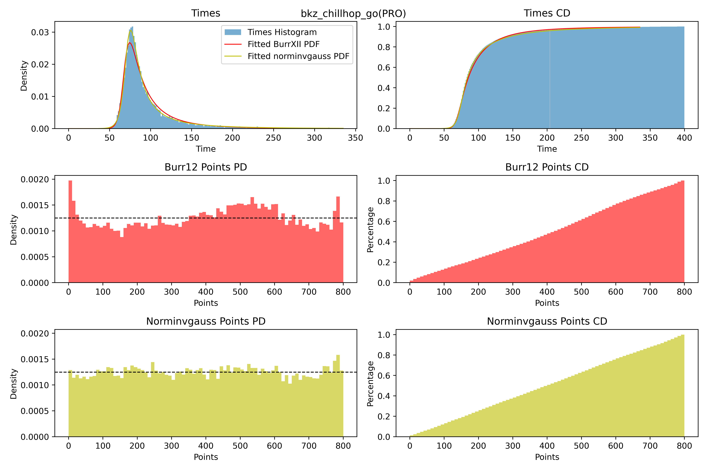
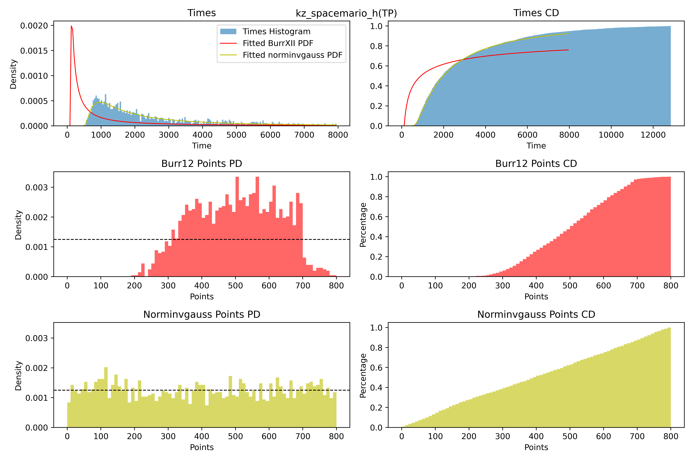
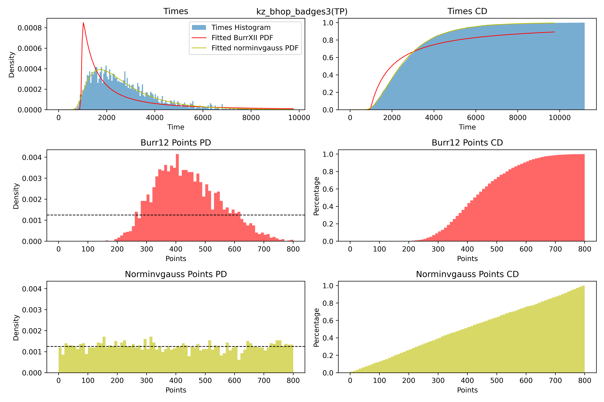
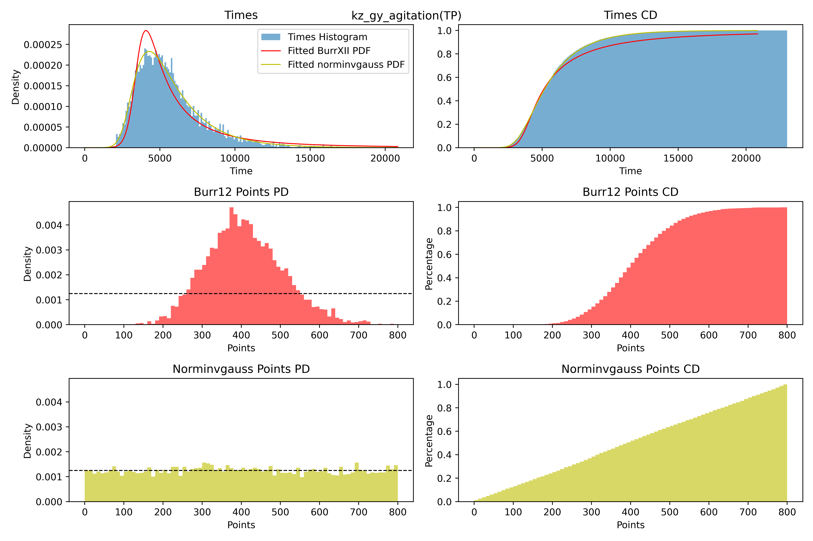

(wip)

# Goal
- Increase points reward difference between top times: Faster times are increasingly harder to obtain, it should be rewarded accordingly

- Fix cases where distribution estimation goes wrong (spacemario, nbdy_maps)

- Add minimum reward to high tier maps

- Make a better system for courses with few completions

- Incentivize PRO runs and get rid of TP only leaderboards

# Description of existing point systems

<details>
  <summary><b><font size = "+2">Current System</font></b></summary>
  
For each course/filter, if your course **have enough completions** your points will have two components. (50 for KZT, 30 for SKZ/VNL). 20% is your absolute rank, and the other 80% is rewarded base on where you belong on the burr12 distribution, for a maximum of 1000.

## 1. **Rank-based reward**:

WR gives 200 points. Every rank afterwards gives 2 less points, with the exception of #2 and WR where the gap is 4 instead of 2.

## 2. **Distribution-based reward**:

Reward depends on how fast you are compared to other players who completed the map.

For every course/filter, you have 4 parameters `c`, `d`, `loc`, `scale`, describing a continuous burr12 distribution and a scaling parameter called `top_scale`. For instance:
```json
  "record_filter_id": 266,
  "c": 8.160439338232338,
  "d": 0.2460614564105553,
  "loc": -0.2770402167330999,
  "scale": 66.06131305008674,
  "top_scale": 1.0097629624724325,
  "created_on": "2018-07-10T00:00:00",
  "updated_on": "2023-08-30T00:00:00",
  "updated_by_id": "0"
```
From this distribution, you can obtain the survival function (SF) of the distribution, which in this case describe the likelihood that your time is faster than a certain value. Then the distribution-based reward is as follows:
```
dist_points = SF(time)*800*top_scale
```
The `top_scale` value is simply calculated as below:
```
top_scale = 1/SF(wr_time)
```
This way you guarantee the WR to have 1000 points, because `dist_points` should always be 800, along with 200 points for absolute rank.

The burr12 distribution isn't updated as soon as a new run is inserted, it is done on a daily basis (to reduce the cost, I assume). The API goes through every PB on the course and compute the 4 `c`, `d`, `loc`, `scale` parameters, repeating it for every course.

- If a course **does not have enough completions**, the points reward will be `1000 / (# completions + 1)`, with exception of the WR holder always having 1000 points. 

### Note:
- Rewards on map with no distribution are problematic, as being #2 on a extremely hard map with only 2 completions gives you a whooping 333 points.

- Also falls apart for some maps where `c < k`, results in L shaped curve which does not correctly reflect times distribution. This shifts the average points to the positive because of the `top_scale` multiplier being significant.

- TODO: Difficulty to get a certain point reward? Seems inconsistent anecdotally

- Complexity of recalculation of Burr is most likely to be O(n) because it has to go through every PB. Also O(n) to update every time for the new distribution curve.

- Filters are split into TP and PRO, there's no filter for `overall`. PRO runs could be faster than TP run yet somehow gets less points.

- TP and PRO WRs both worth 1000 points, but PRO WRs are almost always harder than TP WRs. Also related to the problem above.

- High ranked runs on maps with lots of completions tend to have their distribution points extremely similar, the difference from rank-based rewards is insufficient
</details>

<details>
  <summary><b><font size = "+2">KSF</font></b></summary>

### Note:
- Private formula

- Has group points

- Does care about tier to some extent

- Mostly rank-based for scaling. No reward for going up within a group.

- WR ranges from 2000-3000 depending on (#10 - WR) and (top 10% - WR)

- 0.8x for #2, #3 is 0.8x from #2, etc... to top 10

- Roughly the same multiplier for group points

- No reward for going up in time without change in group. (Unless it's in the top 10% but the effect is most likely small)

</details>

<details>
  <summary><b><font size = "+2">SurfTimer</font></b></summary>
  
Stolen straight from their [github readme](https://github.com/surftimer/SurfTimer):

Points are now distributed in two ways: (1) map completion, and (2) map ranking. Map completion points will be given to all players who complete a specific and are dependent on the tier.
* Tier 1: 25
* Tier 2: 50
* Tier 3: 100
* Tier 4: 200
* Tier 5: 400
* Tier 6: 600
* Tier 7: 800
* Tier 8: 1000

Map ranking points are dependent upon the individuals ranking on the map. This is done firstly by calculation of the WR points for the map. WR points per tier are calculated as follows:
* Tier 1: WR = MAX(250, (58.5 + (1.75 * Number of Completes) / 6))
* Tier 2: WR = MAX(500, (82.15 + (2.8 * Number of Completes) / 5))
* Tier 3: WR = MAX(750, (117 + (3.5 * Number of Completes) / 4))
* Tier 4: WR = MAX(1000, (164.25 + (5.74 * Number of Completes) / 4))
* Tier 5: WR = MAX(1250, (234 + (7 * Number of Completes) / 4))
* Tier 6: WR = MAX(1500, (328 + (14 * Number of Completes) / 4))
* Tier 7: WR = MAX(1750, (420 + (21 * Number of Completes) / 4))
* Tier 8: WR = MAX(2000, (560 + (30 * Number of Completes) / 4))

Once the WR points are calculated the top 10 are points are calculated by multiplying the WR points by a factor. These factors are:
* Rank 2 = WR * 0.8
* Rank 3 = WR * 0.75
* Rank 4 = WR * 0.7
* Rank 5 = WR * 0.65
* Rank 6 = WR * 0.6
* Rank 7 = WR * 0.55
* Rank 8 = WR * 0.5
* Rank 9 = WR * 0.45
* Rank 10 = WR * 0.4

Players who are not in the top 10 but are above the 50th percentile in map ranking will be sorted into 5 groups – with each higher group giving proportionally more points. These groups and their point distribution are as follows:
* Group 1 (top 3.125%) = WR * 0.25
* Group 2 (top 6.25%) = (Group 1) / 1.5
* Group 3 (top 12.5%) = (Group 2) / 1.5
* Group 4 (top 25%) = (Group 3) / 1.5
* Group 5 (top 50%) = (Group 4) / 1.5

Take surf_aircontrol_nbv for example: (You can use sm_mi to see this menu)


###### Credit to NDiamond for theory crafting this point system, I just implemented his idea

### Note:
- Much less agressive than KSF for top 10 calc.

- Purely rank-based for scaling. No reward for going up within a group

- No cap on WR points so it *will* spiral out of control. 

 - Example: WR on t1 maps with 20k completions is 5916 points. WR on t8 map with 2 completions is only 3000.

</details>


<details>
  <summary><b><font size = "+2">Jak's system</font></b></summary>

  https://forum.gokz.org/d/3781-cs2kz-what-would-you-change/61


### Note:
- Purely rank-based for progression, with small bonus for completion

- Gets some points for completion, and literally nothing until top 100 where you suddenly get 150/250 points and then only going up in interval of 5 points until top 10

  - Little reason to improve low tier maps as long as top 100 is out of reach

  - Little reason to improve PB if there's you are slower than the next guy
  
    - Players with 13 hours time on kiwipsychosis can improve a run by 10 hours and receive literally no points, despite improving times on the map to such a degree is way harder than beating top 100 on a random tier 2 map.
<!-- -->
- Being the top 10% on a map with 100 completions worth much more than being top 10% in a map with 2000 completions even if two maps have the same difficulty.
</details>

<details>
  <summary><b><font size = "+2">Szwagi's system</font></b></summary>

  https://forum.gokz.org/d/3781-cs2kz-what-would-you-change/74


```
Since I think NUB/PRO is the correct system, PRO runs that are also NUB pbs should count twice (with the distribution being calculated twice too).
PRO points should reward the full amount.
NUB points should reward half the amount (or 75%, anything goes as long as it's less?).

This should give new players the opportunity to gain ranks while they still need to use teleports, while rewarding the players who at least attempt to run maps without teleports.
```


### Note:
- Is not a completely different system, just tweaks to current system.

- Making pro runs using overall distribution makes more sense than current system.

- Only attempts to solve PRO run related problems of the current system
</details>

# Proposal

<details>
  <summary><b><font size = "+2">Changes</font></b></summary>

- Replace the distribution used by the rank calculation from BurrXII to Normal Inverse Gaussian to better reflect the distribution of times in maps. The new distribution perform slightly better in most cases and significantly better in various extreme cases.
Here you can see some examples of the new distribution (yellow) vs the current distribution (red). The points shown in the graphs only contain the 800 points awarded from the distribution.
<details>
  <summary>bkz_chillhop_go (PRO)</summary>

  Easy and short map, very high amount of completions, most times are very close to the average. 

  
</details>
<details>
  <summary>kz_spacemario_h (TP)</summary>

  One of the most played T6 maps. Medium length with relatively plenty of completions with very spreaded out times.

  
</details>
<details>
  <summary>kz_bhop_badges3 (TP)</summary>

  Long map, decent amount of completions with decently spreaded out times.

  
</details>
<details>
  <summary>kz_gy_agitation (TP)</summary>

  The second longest map in KZ, with a lot of completions and decently spreaded out times.

  
</details>
</details>
